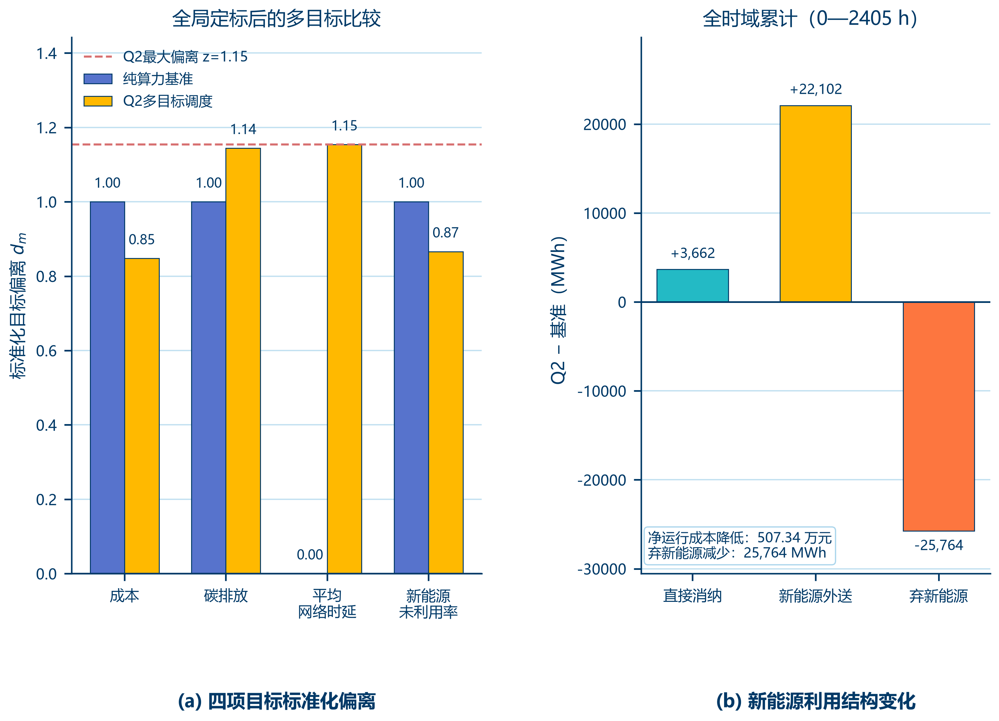
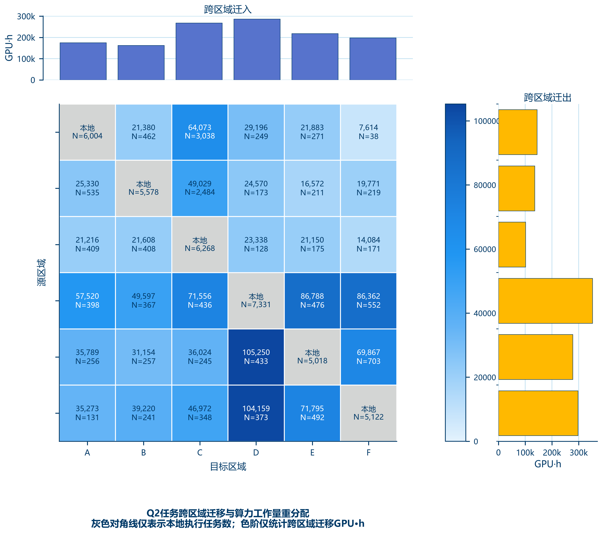
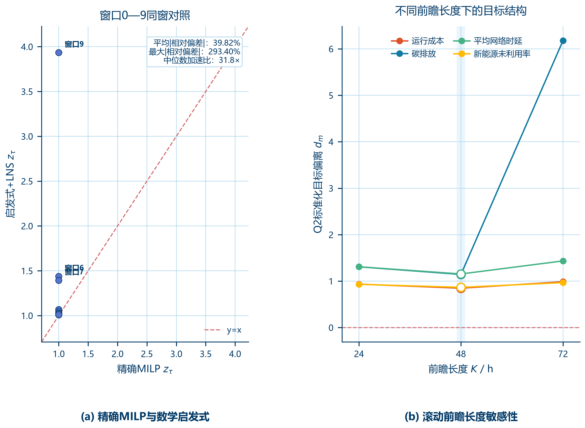

# C题问题2论文手交接清单

更新时间：2026-08-10

本文档用于把问题2当前已经完成的模型、正式结果、检验结果和图表交给论文手。图表和表格已经随本文档复制到同目录下的 `figures` 和 `tables` 文件夹，拿到本文件夹即可完成正文写作。正文中的数值优先以 `tables` 下的 CSV 为准，图仅用于展示，不要从图片上估读数据。

## 一、当前交付结构

### 1. 代码

| 文件 | 用途 |
|---|---|
| [model.py](D:/PyCharm/PyCharm2026.2/Project/huashubei/question/question_02/model.py) | 问题2正式主模型：全局连续定标、边际贪心、容量修复和 LNS-MILP |
| [validation.py](D:/PyCharm/PyCharm2026.2/Project/huashubei/question/question_02/validation.py) | 全时域复算、同口径基线、LNS消融、精确同窗对照和前瞻敏感性检验 |
| [plot.py](D:/PyCharm/PyCharm2026.2/Project/huashubei/question/question_02/plot.py) | 生成问题2三组论文图 |
| [heuristic_window9.py](D:/PyCharm/PyCharm2026.2/Project/huashubei/question/question_02/heuristic_window9.py) | 单独重算异常窗口9的启发式结果，仅作补充审计，不是正式全局结果 |

### 2. 正式结果和检验结果

- [随本交接文件附带的表格](tables)
- [随本交接文件附带的论文图](figures)
- [代码运行日志](D:/PyCharm/PyCharm2026.2/Project/huashubei/question/question_02/outputs/logs)
- 本目录中的 `tables` 文件夹已复制问题2当前输出目录下的全部23个CSV；`figures` 文件夹已复制三组图的PDF和PNG共6个文件。
- [检验运行目录](D:/PyCharm/PyCharm2026.2/Project/huashubei/question/question_02/outputs/validation_runs)

正文最常用的结果文件如下：

| 文件 | 论文用途 |
|---|---|
| [q2_objective_summary.csv](tables/q2_objective_summary.csv) | Q1基准与Q2方案的四项目标、等待时间、迁移比例和资源指标 |
| [q2_baseline_comparison.csv](tables/q2_baseline_comparison.csv) | 同口径基线比较和改善方向 |
| [q2_aggregation_audit.csv](tables/q2_aggregation_audit.csv) | 任务等价类聚合审计 |
| [q2_validation_constraint_audit.csv](tables/q2_validation_constraint_audit.csv) | 任务级、资源级和能源守恒检验 |
| [q2_validation_recomputed_profiles.csv](tables/q2_validation_recomputed_profiles.csv) | 最终调度记录的全时域独立复算 |
| [q2_validation_lns_ablation.csv](tables/q2_validation_lns_ablation.csv) | LNS精修前后消融比较 |
| [q2_validation_exact_vs_heuristic.csv](tables/q2_validation_exact_vs_heuristic.csv) | 窗口0—9的精确模型与启发式同窗对照 |
| [q2_validation_lookahead.csv](tables/q2_validation_lookahead.csv) | K=24、48、72的前瞻敏感性检验 |
| [q2_validation_overview.csv](tables/q2_validation_overview.csv) | 四类检验的汇总状态 |

## 二、论文中应采用的Q2模型

### 1. 基准和研究目标

问题2以问题1得到的“纯算力调度”作为基准，在保持任务集合、任务工作量、候选区域和能源数据不变的前提下，重新决定任务的执行区域和开工时刻，使计算任务在多区域、多时段之间合理分配。

Q2不是重新生成任务，也不是减少任务工作量；它只改变任务的时空分布。

### 2. 决策时域

- 决策窗口：`H=24 h`。
- 前瞻长度：`K=48 h`。
- 实际占用小时：`0—2405`。
- `Hour=2406` 是终止边界，不是可占用的运行小时。
- `LatestFinishHour=2406` 只表示任务可以在终止边界结束，不能解释为任务占用了第2406小时。

### 3. 四项目标

模型同时考虑：

1. 净运行成本；
2. 碳排放量；
3. 平均网络时延；
4. 新能源未利用率。

各目标先用全局理想点和尺度进行统一定标。对第 (m) 个目标，定义

\[
d_m=\frac{F_m-F_m^{\mathrm{ideal}}}{s_m},
\qquad
z=\max_m d_m,
\]

以最小化最大标准化偏离 (z) 为核心的均衡目标。当前正式模型使用全局连续定标，不把不同滚动窗口的局部最优值混在一起比较。

当前定标信息：

| 目标 | 理想点 | 参考尺度 |
|---|---:|---:|
| 净运行成本 | -452965797.614081元 | 33282374.484804元 |
| 碳排放 | 0 tCO₂ | 8.850562453334 tCO₂ |
| 平均网络时延 | 5 ms | 6.887201272032 ms |
| 新能源未利用率 | 0.304190440693 | 0.016649791104 |

### 4. 主要约束

- 每个任务必须且只能执行一次；
- 实时推理任务立即开工；
- 满足最早开工、最晚完成和终止边界；
- 只能选择任务允许的候选区域；
- 满足任务网络时延上限；
- 满足逐区域逐小时GPU、AI IT和设施功率容量；
- 满足最大购电、购售电及新能源外送约束；
- 满足逐区域逐小时能源平衡；
- 任务级结果和全时域资源剖面均需独立复算通过。

### 5. 求解方法

正式主模型采用“全局连续定标 + 多目标边际贪心 + 容量修复 + LNS-MILP”的数学启发式：

1. 先用全局理想点完成四项目标定标；
2. 在 (H=24,K=48) 的滚动窗口中，按照多目标边际代价选择任务的区域和开工位置；
3. 对可能造成容量超限的安排进行容量修复；
4. 对困难局部任务类使用小规模LNS-MILP精修。

主模型不是对50000个任务直接求解完整全局MILP。SciPy/HiGHS只用于局部修复和LNS子问题；完整精确MILP只在检验中对窗口0—9进行同窗对照。因此，论文中应称其为“满足硬约束的数学启发式高质量可行方案”，不能称为“完整模型的全局最优解”。

任务等价类聚合采用完全属性等价规则，仅合并所有调度属性完全相同的任务：50000个原始任务对应49991个等价类，最大等价类大小为2。该处理主要用于保持整数计数模型的可计算性，不应写成“大幅压缩了数据规模”。

## 三、Q2正式结果

### 1. Q1基准与Q2方案对比

| 指标 | Q1纯算力基准 | Q2均衡方案 | 变化及解释 |
|---|---:|---:|---|
| 净运行成本 | -419683423.13元 | -424756811.00元 | 降低507.34万元 |
| 碳排放 | 8.850562 tCO₂ | 10.125791 tCO₂ | 增加1.275228 tCO₂ |
| 平均网络时延 | 5.000000 ms | 12.946840 ms | 增加7.946840 ms |
| 新能源利用率 | 67.91598% | 68.13914% | 提高0.22316个百分点 |
| 新能源未利用率 | 32.08402% | 31.86086% | 下降0.22316个百分点 |
| 平均等待时间 | 0.00116 h | 30.89284 h | 多目标均衡下的调度代价 |
| 跨区域迁移任务比例 | 0 | 29.35800% | 发生跨区域时空重分配 |
| 跨区域迁移GPU工作量 | 0 GPU·h | 1308141.7333 GPU·h | 仅改变执行位置和时间 |

这里的“净运行成本”为购电成本与售电收益合并后的结算值，数值为负不代表出现负用电量。论文中建议直接写“净运行成本降低507.34万元”。

### 2. 守恒和资源结果

- Q1基准与Q2方案累计GPU工作量均为 `5020786.65 GPU·h`；
- Q1基准与Q2方案累计AI IT能耗均为 `738927.9853 MWh`；
- Q2任务总数仍为50000个，未通过遗漏任务改善指标；
- Q2最大GPU利用率为1，最大AI IT容量利用率约为1；
- 最大购电违反量为0；
- 最大能源平衡残差为0；
- 第2406小时正占用量为0。

新能源结构图中的变化量满足

\[
3662+22102-25764=0,
\]

即减少的弃新能源由直接消纳和外送共同解释，能源总量没有凭空增加。

## 四、Q2模型检验结果

### 1. 全时域独立复算与守恒检验：通过

依据最终50000条任务调度记录，重新构造全部2406个运行小时、6个区域的资源和能源剖面。任务唯一执行、候选区域、网络时延、时间窗、容量和能源平衡的违反计数均为0；最大约束违反量 (V_{\max}=0)，最大能源平衡残差 (E_{\max}=0)，第2406小时正占用量为0。

该检验支持论文结论：Q2方案是可执行的，且不存在漏任务、重复执行、资源超限或能源账不闭合问题。

### 2. 同口径基线和物理机制检验：通过，但不是“四项同时改善”

Q1基准和Q2方案采用相同的NonAI负荷、PUE、购售电边界和新能源结算方式重新计算指标。结果表明：成本和新能源利用率方向改善，碳排放和平均网络时延上升，说明Q2呈现真实的多目标权衡，而不是指标口径变化造成的虚假收益。

### 3. LNS消融检验：支持局部精修有效

- 共检验91个启发式滚动窗口；
- 45个窗口接受了LNS改进，改善窗口比例为49.45%；
- 在接受改进的窗口中，平均改善率约为2.43%；
- 对不能改善独立复算目标的候选方案，程序保留原方案，接受不一致数为0。

该结果可以支持“LNS能够修正部分贪心局部决策”，但不能单独证明全局最优性。

### 4. 精确同窗对照：不能写成“启发式近优”

窗口0—9在相同历史状态、任务集合和定标参数下进行精确模型与启发式对照。启发式的中位数加速约31.8倍，但最大标准化偏离相对差为293.404%，所有窗口均不满足“相对差不超过5%”的预设条件。

异常窗口为：

| 项目 | 结果 |
|---|---:|
| WindowID | 9（第10个对照窗口，\(\tau=216\)） |
| 精确模型 (z) | 1.000000 |
| 启发式 (z) | 3.934045 |
| 相对偏差 | 293.404% |
| 精确模型耗时 | 650.49 s |
| 启发式耗时 | 17.79 s |

因此，正文可写“启发式显著降低了计算时间，多数窗口结果较为接近，但少数高压窗口存在明显质量损失”；不能写“启发式与精确模型高度一致”或“获得全局近优解”。

### 5. 前瞻长度敏感性：K=48是折中选择，不是完全稳定

三种前瞻设置均通过硬约束和方向检验，成本相对Q1基准均降低，新能源利用率均提高：

| 前瞻长度 | 运行时间 | Q2净运行成本 | Q2碳排放 | Q2新能源利用率 | 解释 |
|---:|---:|---:|---:|---:|---|
| K=24 h | 1189.1 s | -421865306.44元 | 11.572990 tCO₂ | 68.0312% | 可行，成本和新能源方向正确 |
| K=48 h | 1813.2 s | -424756811.00元 | 10.125791 tCO₂ | 68.1391% | 成本、新能源和碳排放的综合折中 |
| K=72 h | 4974.7 s | -420152895.36元 | 54.674761 tCO₂ | 67.9703% | 碳排放标准化偏离显著增大 |

所以论文中应写“当前数据下K=24与K=48的目标结构较接近，而K=72导致碳排放明显恶化；综合目标均衡性和计算规模，选取K=48 h”。不要把检验汇总中的 `PASS_DIRECTION_STABLE` 扩写成“所有目标结构稳定”。该状态只表示硬约束通过且成本、新能源两个主要方向没有反转。

## 五、当前论文图表及用法

PNG用于预览，论文优先使用同名PDF。

### 第一组：核心结果和新能源机制

- [q2_group1_core_results.pdf](figures/q2_group1_core_results.pdf)
- [q2_group1_core_results.png](figures/q2_group1_core_results.png)

左图展示四项目标相对基准的标准化变化：成本和新能源未利用率改善，碳排放和时延牺牲。右图展示弃新能源减少后转化为直接消纳和外送的结构关系。

### 第二组：跨区域调度机制

- [q2_group2_dispatch_mechanism.pdf](figures/q2_group2_dispatch_mechanism.pdf)
- [q2_group2_dispatch_mechanism.png](figures/q2_group2_dispatch_mechanism.png)

图中跨区域迁移任务数为14679个，占50000个任务的29.358%。矩阵对角线的灰色单元表示本地执行任务数；热力颜色只统计非对角线跨区域迁移GPU工作量，不要把对角线灰色数值解释为热力图的GPU·h值。

### 第三组：求解质量和前瞻敏感性

- [q2_group3_model_validation.pdf](figures/q2_group3_model_validation.pdf)
- [q2_group3_model_validation.png](figures/q2_group3_model_validation.png)

左图应如实保留窗口9的异常点，用于说明启发式的速度—质量权衡；右图标题和正文应使用“前瞻长度敏感性”，不要写成“前瞻长度稳定性”。

## 六、可直接用于正文的结果表述

> 以问题1所得纯算力调度为基准，问题2在保持任务总量和累计计算工作量不变的条件下，采用全局连续定标的多目标滚动数学启发式，对任务执行区域和开工时刻进行联合优化。决策窗口取24 h，前瞻长度取48 h。结果表明，Q2方案净运行成本由\(-4.196834\times10^8\)元降至\(-4.247568\times10^8\)元，降低约507.34万元；新能源利用率由67.91598%提高至68.13914%。与此同时，碳排放由8.850562 tCO₂增加至10.125791 tCO₂，平均网络时延由5.000 ms增加至12.946840 ms，体现了成本、新能源消纳、碳排放和通信服务之间的实际权衡。最终方案完成全部50000个任务，跨区域迁移任务比例为29.358%，全时域独立复算的最大约束违反量和能源平衡残差均为0。

> 由于完整全局整数规划规模过大，本文采用边际贪心、容量修复和局部LNS-MILP相结合的数学启发式。检验表明，LNS在91个窗口中的45个窗口产生了可接受改进，启发式相对精确同窗对照的中位数加速约31.8倍；但窗口9出现293.404%的标准化偏离，因此本文将最终方案表述为满足全部硬约束的高质量可行方案，不宣称其为全局最优或普遍近优解。前瞻敏感性检验表明，K=72会导致碳排放明显恶化，综合质量和计算规模后选取K=48 h。

## 七、论文表述边界

### 可以写

- “多目标滚动数学启发式”或“边际贪心—容量修复—LNS-MILP方法”；
- “Q2方案在同口径下降低净运行成本并提高新能源利用率”；
- “成本、新能源利用率、碳排放和网络时延之间存在权衡”；
- “全时域独立复算通过，方案满足任务、容量、能源和终止边界约束”；
- “LNS对部分困难窗口具有精修作用”；
- “启发式取得约31.8倍中位数加速，但少数窗口存在质量损失”；
- “K=48是当前数据下的综合折中选择”。

### 不能写

- “四个目标同时改善”；碳排放和平均时延实际上上升；
- “启发式得到全局最优解”；正式主模型不是完整全局MILP；
- “启发式与精确模型高度一致”或“普遍达到5%以内”；窗口9相对偏差为293.404%；
- “Q2对K=24、48、72完全稳定”；K=72的碳排放明显恶化；
- “任务聚合大幅压缩数据”；50000个任务只形成49991个完全等价类；
- “第2406小时被占用”；2406是终止边界，实际运行小时为0—2405；
- “负运行成本代表负用电量”；负值是购售电合并后的净结算结果。

## 八、交给论文手前的最终清单

- [ ] 模型正文写清`H=24 h、K=48 h`以及第2406小时为终止边界；
- [ ] 目标函数写成四目标全局定标后的最小最大标准化偏离；
- [ ] 结果表直接引用`q2_objective_summary.csv`和`q2_baseline_comparison.csv`；
- [ ] 可行性结论引用`q2_validation_constraint_audit.csv`和`q2_validation_recomputed_profiles.csv`；
- [ ] 检验部分如实写出窗口9的293.404%异常，不删除异常点；
- [ ] 把“稳定性”改为“前瞻长度敏感性”；
- [ ] 图2图注说明对角线灰色单元和热力颜色的不同含义；
- [ ] 正文使用PDF图，PNG只用于预览；
- [ ] 不把“方向检验通过”写成“所有目标稳定”；
- [ ] 不把“高质量可行方案”写成“全局近优方案”。
